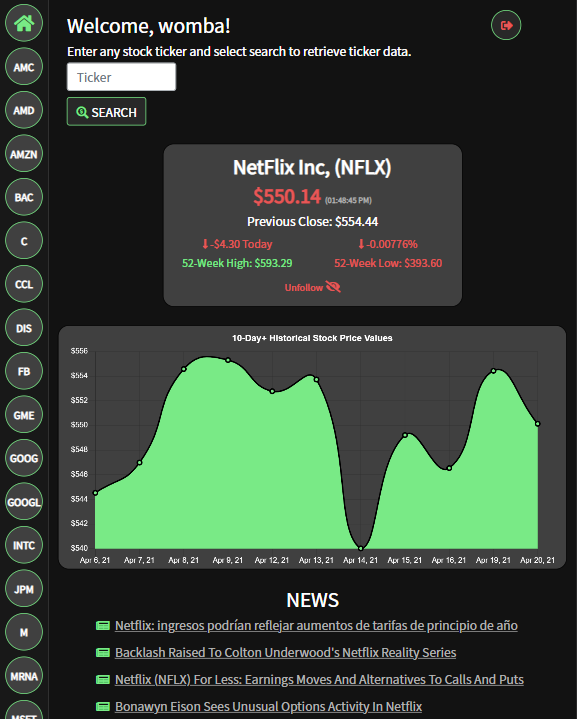

# Vantage - Stock Market News

## Description

A MERN (Redux) stack application using IEX Cloud to retrieve and display current stock information, historical information, and news. Registered users can add or remove tickers from their watchlist to keep up to date on the latest market movements.

## Table of Contents

- [Installation](#installation)
- [Usage](#usage)
- [Contributing](#contributing)
- [Questions](#questions)

## Installation

_Steps required to install package:_

To install the application locally, clone this repository down to your machine. Open within the IDE of your choice and utilize `npm i` to install all necessary server and client dependencies. Additionally, you will need to set up a .env file containing your MongoDB URI, JWT Secret, and IEX Cloud API key. Once your .env file has been set-up you may use `npm run start` to launch both the server and client.

_.env File Set-up:_

`MONGODB_URI=YOUR URI STRING HERE`

`JWT_SECRET=YOUR JWT SECRET HERE`

`IEX_KEY=YOUR API KEY HERE`

## Usage

_Examples of project use:_

## Contributing

_If you are interested in contributing to this project, please follow the below instructions:_

Pull requests not welcome at this time.

## License

MIT License

## Questions

_If you have any questions regarding this application, please utilize the below contact information:_

[kmiller343@gmail.com](mailto:kmiller343@gmail.com)

[GitHub Profile](https://www.github.com/k1te-m)
